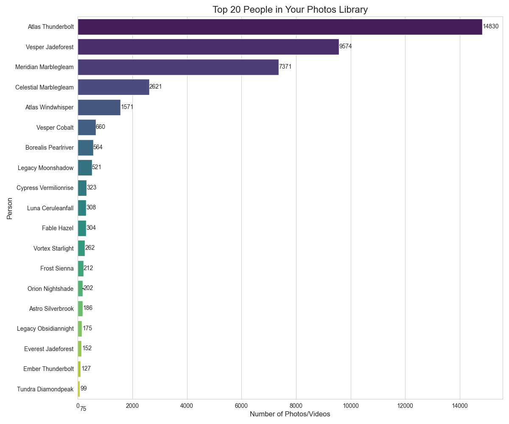
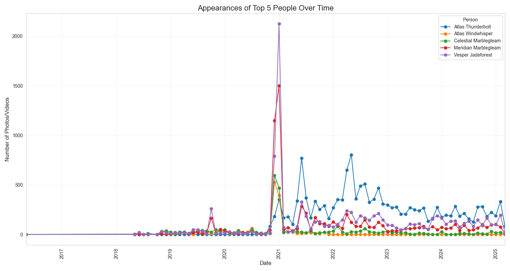

# Photos Library Growth Analyzer

This project provides tools to analyze your Photos Library, including how it has grown in size over time and who appears most frequently in your photos.

## Library Growth Analysis


## People Analysis



## Features

### Library Growth Analysis
- Measures the size of media added to your Photos Library each month
- Calculates cumulative growth over time
- Generates visualizations of monthly and cumulative growth
- Provides summary statistics about your library growth
- Exports data to CSV for further analysis

### People Analysis
- Identifies who appears most frequently in your photos and videos
- Counts the number of photos/videos each person appears in
- Tracks how people appear in your library over time
- Generates visualizations of top people and their timeline
- Exports people data to CSV for further analysis

## Example Output

### Library Growth Analysis
The script generates two main visualizations:
1. **Monthly Growth**: Shows how much data (in GB) was added to your Photos Library each month
2. **Cumulative Growth**: Shows the total size of your Photos Library over time

It also provides summary statistics such as:
- Total library size
- Average monthly growth
- Maximum monthly growth
- Recent growth trends (3, 6, and 12 months)
- Top months with highest growth

### People Analysis
The script generates two main visualizations:
1. **Top People**: Shows the people who appear most frequently in your photos/videos
2. **People Timeline**: Shows how the top people appear in your photos over time

It also provides statistics such as:
- Total number of people identified
- Total number of faces detected
- Total number of photos/videos with people
- Detailed breakdown of top people

## Requirements

- Python 3.6+
- pandas
- matplotlib
- numpy
- seaborn

## Installation

1. Clone or download this repository
2. Install the required dependencies:

```bash
pip install -r requirements.txt
```

## Usage

### Library Growth Analysis

```bash
python analyze_photos_library.py
```

### People Analysis

```bash
python analyze_photos_people.py
```

By default, the scripts look for your Photos Library at:
`/Users/jordan/Pictures/Photos Library.photoslibrary`

If your library is in a different location, you can modify the `PHOTOS_DB_PATH` variable in the scripts.

## Output

### Library Growth Analysis
The script will:
1. Print summary statistics to the console
2. Save a CSV file with monthly growth data (`photos_library_growth.csv`)
3. Generate and save a visualization (`photos_library_growth.png`)
4. Display the visualization

### People Analysis
The script will:
1. Print statistics about people in your library to the console
2. Save a CSV file with people data (`photos_people_data.csv`)
3. Generate and save visualizations (`photos_people_count.png` and `photos_people_timeline.png`)
4. Display the visualizations

## Notes

- These scripts access the SQLite database in your Photos Library to gather information
- The scripts are read-only and do not modify your Photos Library in any way
- The scripts may take some time to run if you have a large library 